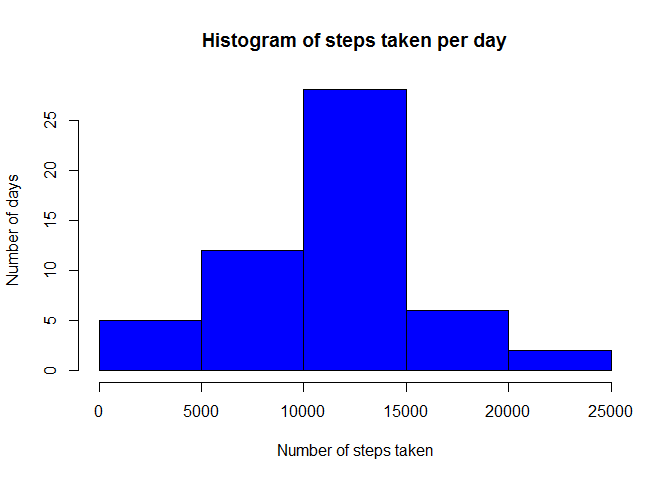
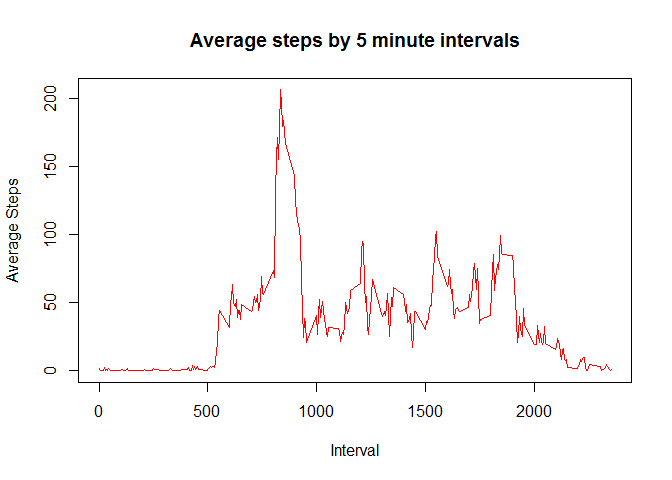
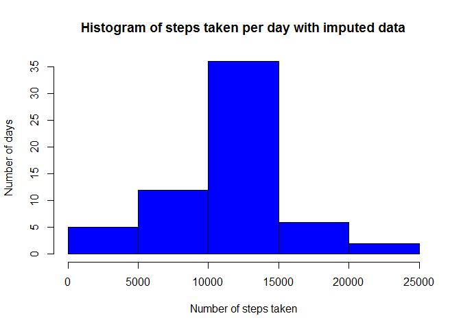
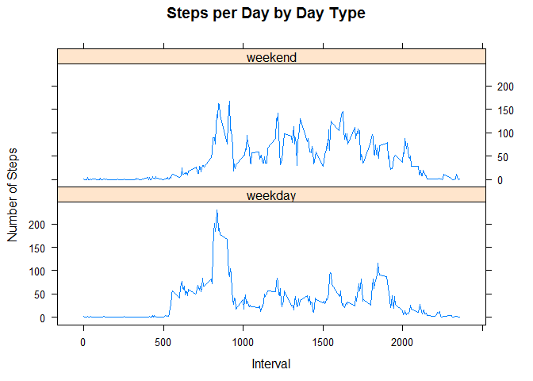

# Reproducible Research: Peer Assessment 1


Clear the Environment

```r
rm(list=ls())
```

##Loading and preprocessing the data

1: Load the dataset

```r
Activity <- read.csv("c:/coursera/Course5Project1/activity.csv")
```

##What is mean total number of steps taken per day

1: Calculate the total number of steps taken per day

```r
library(sqldf)
```

```
## Loading required package: gsubfn
## Loading required package: proto
## Loading required package: RSQLite
## Loading required package: DBI
```

```r
DailySteps <- sqldf(
        'Select
                date,
                sum(steps) as DailySteps
        From
                Activity
        Group By
                date')
```

```
## Loading required package: tcltk
```

```r
DailySteps$DailySteps <- as.numeric(DailySteps$DailySteps)
```

2: Make a histogram of the total number of steps taken each day

```r
hist(DailySteps$DailySteps
     , col="blue"
     , main="Histogram of steps taken per day"
     , xlab = "Number of steps taken"
     , ylab = "Number of days")
```

 

3: Calculate and Report the Mean and Median of the total number of steps taken per day

```r
StepMean <- mean(DailySteps$DailySteps, na.rm=TRUE)
StepMedian <- median(DailySteps$DailySteps, na.rm=TRUE)
```

The mean steps per day is: 1.0766189\times 10^{4}  
The median steps per day is: 1.0765\times 10^{4}  

##What is the average daily activity pattern?

1: Make a time series plot of the 5-minute interval (x-axis) and the average number of steps taken, averaged across all days (y-axis)
Calculate the average steps taken per day per interval


```r
library(sqldf)
DailyInterval <- sqldf(
        'Select
                Interval,
                Avg(steps)  as IntervalAverage
        From
                Activity
        Group By
                Interval')
```

Create the Time Series plot


```r
plot(IntervalAverage ~ interval
     , data=DailyInterval
     , type = "l"
     , col = "red"
     , main = "Average steps by 5 minute intervals"
     , xlab = "Interval"
     , ylab = "Average Steps")
```

 

2: Which 5-minute interval, on average across all the days in the dataset, contains the maximum number of steps  

Find the interval with the highest average number of steps


```r
MaxInterval <- DailyInterval[DailyInterval$IntervalAverage == 
                                     max(DailyInterval$IntervalAverage),1]
```

The interval with the maximum average number of steps is Interval 835

##Imputing missing Values

1: Calculate and Report the total number of missing values in the dataset (i.e. the total number of rows with NAs)


```r
TotalNAs <- sum(is.na(Activity))
```

The number of NAs in the dataset is 2304

2: Devise a strategy for filling in all of the missing values in the dataset  
  - Will fill all NAs with the mean for that 5-minute interval
  
3: Create a new dataset that is equal to the original dataset but with the missing data filled in 
  

```r
library(sqldf)
ActivityNew <- sqldf(
        'Select
                Case When steps is null Then IntervalAverage Else steps end as steps,
                date,
                a.interval
        From
                Activity  As a
        Inner Join
                DailyInterval as b
        on 
                a.interval = b.interval')
```

4: Make a histogram of the total number of steps taken each day and Calculate and report the mean and median total number of steps taken per day.  

Calculate the total number of steps taken each day

```r
library(sqldf)
DailyStepsNew <- sqldf(
        'Select
                date,
                sum(steps) as DailySteps
        From
                ActivityNew
        Group By
                date')
DailyStepsNew$DailySteps <- as.numeric(DailyStepsNew$DailySteps)
```

Create the histogram

```r
hist(DailyStepsNew$DailySteps
     , col="blue"
     , main="Histogram of steps taken per day with imputed data"
     , xlab = "Number of steps taken"
     , ylab = "Number of days")
```

 

Report the Mean and Median of the total number of steps taken per day versus the original

```r
StepMeanNew <- mean(DailyStepsNew$DailySteps)
StepMedianNew <- median(DailyStepsNew$DailySteps)
```

The Original mean steps per day is: 1.0766189\times 10^{4} vs a mean of 1.074977\times 10^{4} with imputed data  
The Original median steps per day is: 1.0765\times 10^{4} vs a median of 1.0641\times 10^{4} with imputed data

Do these values differ from the estimates from the first part of the assignment?  
- Yes, the values differ

What is the impact of imputing missing data on the estimates of the total daily number of steps? 
- The impact would be determined by the method for imputing the values.  In this case, it lowered the estimates

##Are there differences in activity patterns between weekdays and weekends?

1: Create a new factor variable in the dataset with two levels - "weekday" and "weekend" indicating whether a given date is a weekday or weekend day.


```r
library(dplyr)
```

```
## 
## Attaching package: 'dplyr'
## 
## The following object is masked from 'package:stats':
## 
##     filter
## 
## The following objects are masked from 'package:base':
## 
##     intersect, setdiff, setequal, union
```

```r
library(lubridate)
ActivityNew <- mutate(ActivityNew, WeekDay = weekdays(ymd(ActivityNew$date)))
ActivityNew <- mutate(ActivityNew, DayType = ifelse((WeekDay == "Sunday") | (WeekDay == "Saturday"), "weekend","weekday" ))
ActivityNew$DayType <- as.factor(ActivityNew$DayType)
```

2: Make a panel plot containing a time series plot of the 5-minute interval (x-axis) and the average number of steps taken, averaged across all weekday days or weekend days (y-axis)


```r
DayTypePlots <- aggregate(steps ~ interval + DayType, ActivityNew, mean)

library(lattice)

xyplot(DayTypePlots$steps ~ DayTypePlots$interval | DayTypePlots$DayType
        , main="Steps per Day by Day Type"
        , xlab = "Interval"
        , ylab = "Number of Steps"
        , layout = c(1,2)
        , type = "l")
```

 
